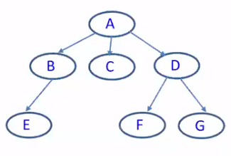

[\<- 05/06](05-06.md)

---

## Non-Linear Lists

- A non-linear list is a list in which each element can have **more than one successor**
- There are two types of non-linear lists: **trees and graphs**

# Tree

- In Computer Science, a Tree is upside down

## Basic Concepts
### Tree & Node Degree

- A **tree** consists of a finite set of elements, called **nodes**, and a finite set of directed lines, called **branches**, that connect the nodes
	- The **degree** of the node: the number of branches associated with a node
	- **Indegree**: the number of branches that are directed toward the node (parents)
	- **Outdegree**: the number of branches that are drected away from the node (children)

### Node Types

- If the tree is not empty, the first node is called the **root**. The indegree of the root is always 0.
- Any node with an outdegree of zero is called a **leaf**. That is a node with no successors.
- Internal Node: not root, not leaf

### More Terms

- Parent: a node with successor nodes
- Child: a node with a predecessor
- Siblings: Nodes with the same parent
- Ancestor: Any node in the path from the root to the node
- Descendent: any node in the paths from a given node to a leaf are descendent in that node
- Level: the level of a node is its distance from the root
	- ex. a root will have level 0, its children will have level 1, those nodes' children will have level 2, etc.
- Height/Depth: the height of a tree is the level of the leaf in the longest path from the root plus 1

- True or False: 
	- Siblings are always at the same level -> **True**
	- All the nodes at the same level are siblings -> **False**
		- They may be at the same level and have different parents

## Exercise

Print a singly linked list in reverse order
- Hint: using recursion
- We'll use recursion a lot for tree operations

## What is Recursion

- Computer Science:
	1. A method that carries out its task by **making a call(s) to itself**
	2. Such calls should be able to **reduce the problem** and **solve it** in the end

- Pseudo Code:

```
my_function(a1, b1, c1){
	handle the simplest case
	my_functino(a2, b2, c2);
}
```

- For more info, see chapter 2 in the textbook

Now back to the exercise: printing a singly linked list in reverse order

```
void printReverse(NODE *pCur){
	if(pCur == NULL) return; //base case
	printfReverse(pCur->next);
	printf("%d", pCur->data);
}
```

# Trees and Recursion

## Subtree

- A subtree is any connected structure below the root
- Note that a single node is also a subtree

- We can also define a tree **recursively**
- A tree is either
	- empty
	- a node from which hierarchically descend zero or more subtrees

## Using Recursion to Traverse a Tree

- How to use recursion algorithm for visiting/printing out all nodes in a tree?
- Recursive Case:
	- print our the current node
	- Traverse each subtree(call the self-similar function by passing the root of each subtree)
- Best Case:
	- print out an empty tree
	- Dow what? **Nothing but return**

Pseudo Code:

```
void visit(n){
	if(n is empty) return;
	print n;
	for each child ch of n do
		visit(ch);
}
```



- For the above example, the printing is: A, B, E, C, D, F, G
	- Handle parent, then children (called **preorder traversal**)

---

- Alternatively, we can use a bottom-up approach:

```
void postorder(n){
	if(n is not empty){
		for each child ch of n do
			postorder(ch);
		print n;
	}
}
```

- For the above example, the printing is: E, B, C, F, G, D, A
- This type of traversal is called a **postorder** traversal (because the root comes **after** its children)
- Also called a **bottom-up** traversal
	
---

- Understand how pre-order and post-order result in the parent being before or after its descendants respectively

## Count Nodes

- In what order should you **count** your nodes?
	- Doesn't matter
- Let's count all the ndoes in a tree:

```
int count(n){
	if(n is empty) return 0;
	int cnt == 1; //count yourself
	for each child c of n do
		cnt = cnt + count(c);
	return cnt;
}
```

## Tree Height

- How to count the height of a tree recursively?
	- add 1 to the height of the maximum of your children
- Recursively, the height can be defined as follows:
	- `height(n) =`
		- 0 if n is empty
		- 1 + max(height(ci)), otherwise

## Destroy a Tree

- Should you destroy your tree in preorder or postorder?
	- Answer: postorder!
- Why?
	- Kill all your children before kill yourself

## Summary

- What is preorder? What is postorder?
- Should we use preorder or postorder to do the following tasks?
	- Print a tree
	- Count the tree node
	- Search a tree
	- Destroy a tree
- What is the print sequence for the tree below if we use preorder? How about postorder?

## Binary Trees

- In a **general tree**, each node can have an arbitrary number of children
- In a **binary tree**, each node has at most 2 children. We refer to them by name:
	- left child
	- right child

- Implementation:

```
struct node{
	int data;
	struct node *left;
	struct node *right;
};
```

## Binary Trees - Traversal

- How to traverse a binary tree? The same as traversing a tree, except that we have only two children for binary trees (no need for a loop)
- Write the code to recursively visit all the nodes in a binary tree. Given the function as `void printTree(NODE *n)`

```
void printTree(NODE *n){
	if(n == NULL) return;
	printf("%d\n", n->data);
	printTree(n->left);
	printTree(n->right);
}
```

- Note that the above code is a pre-order traversal
- What is the postorder way to traverse a binary tree?

```
void printTree(NODE *n){
	if(n == NULL) return;
	printTree(n->left);
	printTree(n->right);
	printf("%d\n", n->data);
}
```

## Binary Trees - Height

- How to count the height of a general tree?
	- add 1 to the height of the maximum of your children
- How to count the height of a binary tree recursively?
	- add 1 to the height of the maximum of your left child and right child
	
```
int height(NODE *np){
	if(np == NULL) return 0;
	return(1 + max(height(np->left), height(np->right))); //note that we assume max is defined somewhere else (not a native C function)
}
```

alternatively:

```
int height(NODE *np){
	if(np == NULL) return 0;
	lh = height(np->left);
	rh = height(np->right);
	return(1 + (lh > rh ? lh : rh));
}
```

---

[-> 05/11](05-11.md)
