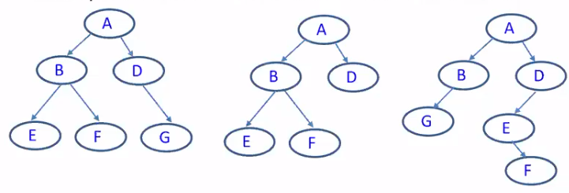
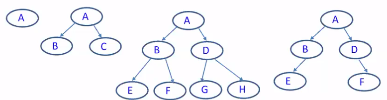
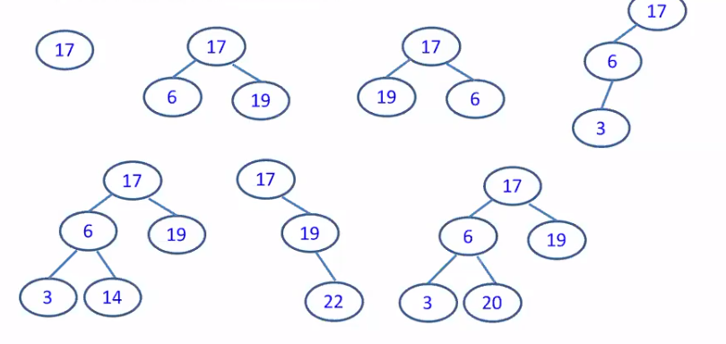
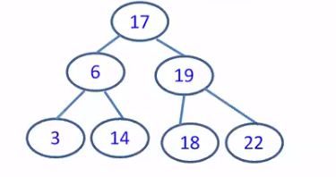

[\<- 05/08](05-08.md)

---

## Binary Trees - Height

- If a binary tree has height 'h', what are the minimum and maximum number of nodes it could have
- min n = h
- max n = 2^h - 1
	- at L0 -> 1 node
	- at L2 -> 2 nodes
	- at L3 -> 4 nodes
	- at L4 -> 8 nodes
	- ... at L(h-1) -> 2^(h-1)
	- complete tree

- If a binary tree has 'n' nodes then what are its minimum and maximum heights
- min h = floor(log(n)) + 1
- max h = n

## Balanced Binary Tree

- Balance factor for a binary tree
	- The difference in height between its left and right subtrees
		- Balance factor = (h_left - h_right)
		- Can be negative or positive
	- Examples: What are the balance factors for tree A?



- Ex1: Balance Factor = 2-2 = 0
- Ex2: Balance Factor = 2-1 = 1
- Ex3: Balance Factor = 2-3 = -1

- Balanced binary tree:
	- The height of its subtrees differs by no more than one, and its subtrees are also balanced

## Binary Trees - Complete Tree

- Complete Tree
	- A complete tree has the maximum number of entries for its height
		- Not that the maximum number is reached **when the last level is full**
- Whether the following trees are complete trees?



- Ex1. is complete
- Ex2. is complete
- Ex3. is complete
- Ex4. is not complete
	- is it a nearly complete tree? no

--- 

- So far, we don't care the value of the tree nodes. We only care the **tree structure**

- From now on, we start to care **the values of the tree nodes**

## BST - Definition

- A binary search tree is a binary tree that has **search order property**
	- For each node in the tree, all the values to the left of the node are less than its value and all values to the right of the node are greater than its value
	- Each subtree is itself a binary search tree

- We can also define a BAST recursively. A BST is either:
	- empty, OR
	- a node with data, and two sub-trees such that all values in the left subtree are less than the root, and all values in the right subtree are larger than the root
		- In other words, both subtrees themselves BSTs
- "BSTs all the way down"

- Which of these are BSTs?



- Ex1. yes
- Ex2. yes
- Ex3. no
- Ex4. yes
	- It doesn't have to be balanced or complete
- Ex5. yes
- Ex6. yes
- Ex7. no
	- 20 is greater than 17

- A BST is **not necessarily** to be iether a balanced tree or a complete tree!

## BST - Search

- How to do search?
	- Start from root
	- if(Root == target) return true;
	- if(Root < target) search right child;
	- if(Root > target) search left child;

- When searching a BST, we start at the root but then need only go to the left or the right

## BST - Recursive Search

```
bool find(NODE *root, int x){
	if(root == NULL) return false;
	if(root->data > x) return find(root->left, x);
	if(root->data < x) return find(root->right, x);
	return true; //x = root->data
}
```

## BST - Iterative Search

```
bool find(NODE *root, int x){
	while(root != NULL){
		if(x < root->data) root = root->left;
		else if(x > root->data) root = root->right;
		else return true;
	}
	return false;
}
```

## BST vs. Binary Search

- These algorithms should remind you of binary search from week 2
- ex.

| | | | | | | |
|-|-|-|-|-|-|-|
|3|6|14|17|18|19|22|



- Now can we answer the question of big O?
	- Remember worst case: n = h (you would need to compare every node!)
	- Binary Search: O(log(n))
	- BST: O(n)

## BST - Min/Max

- How to find the minimum/maximum element in a BST?
	- Min node is the leftmost node at the bottom level
	- Max node is the rightmost node at the bottom level

- Can we use recursions? yes
- Can we use iterations? yes

## BST - recursive Min

- Where is the minimum node in a BST? let's find it recursively
	- Base case?
	- Recursive case?

```
int minimum(NODE *np){
	assert(np != NULL);
	if(np->left == NULL) return np->data;
	return minimum(np->left);
}
```

## BST - iterative Min

- Can we find it through iterations?

```
int minimum(NODE *np){
	assert(np != NULL);
	while(np->left != NULL){
		np = np->left;
	}
	return np->data;
}
```

## BST - Traversal

- **Preorder**
	- Self, Left, Right (SLR)
- **Postorder**
	- Left, Right, Self (LRS)
- how about Left, Self, Right (LSR)?
	- **"Inorder" traversal**

```
void inorder(NODE *np){
	if(np == NULL) return;
	inorder(np->left);
	printf("%d\n", np->data); //printf now in middle
	inorder(np->right);
}
```

## Iteration & Recursion

- **Can we do traversal through iterations instead of recursions?**
	- Every time when you make a choice, you can only visit part of the tree. You need to **return** to your original decision to visit the rest part of the tree
	- For iterations, once you get to the next iteration, the information in the previous iteration will be lost
- **When can we use iterations?**
	- when we don't need to return back to the previous
	- Left, Right, Self (LRS)

---

[05/13 ->](05-13.md)
