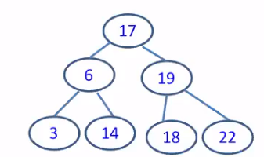

[\<- 05/11](05-11.md)

---

## BST - Insertion

- To insert data, we need to follow the branches to an empty subtree and then insert the new node
- All inserts take place at a leaf or at a leaflike node - a node that has only one subtree
- Example: insert 15, 13



- For 15
	- 15 is less than 17
	- 15 is greater than 6
	- 15 is greater than 14 -> insert in the right child of the 14 node

- For 13
	- 13 is less than 17
	- 13 is greater than 6
	- 13 is less than 14 -> insert in the left child of the 14 node

## Exercise

- Give me an arbitrary number and let's insert it into the tree
	- 50
	- 30
	- 60
	- 20
	- 100
	- 10

- for 50
	- We start with an empty tree, so 50 becomes the root

- for 30
	- 30 is less than 50 -> insert in the left child of the root

- for 60
	- 60 is greater than 50 -> insert in the right child of the root

- for 20
	- 20 is less than 50
	- 20 is less than 30 -> insert in the left child of the 30 node

- for 100
	- 100 is greater than 50
	- 100 is greater than 60 -> insert in the right child of the 60 node

- for 10
	- 10 is less than 50
	- 10 is less than 30
	- 10 is less than 20 -> insert in the left child of the 20 node

- What's the runtime for something like this? **O(h)** (h being the height of the tree)

## Insertion Code

```
bool insertNode(NODE *root, NODE *np){
	assert(np != NULL);

	//Base case
	if(root == NULL) root = np;

	//If the node to be inserted is smaller than the root's data, it lies in left subtree
	if(np->data < root->data) return insertNode(root->left, np);

	//If the node to be inserted is greater than the root's data, it lies in the right subtree
	else if(np->data > root->data) return insertNode(root->right, np);

	//if x is the same as root's data
	else return false;
}
```

- This code doesn't work (why?)
	- It creates a disconnected tree
	- The solution? Double pointers!

- What is the correct code?

```
bool insertNode(NODE **root, NODE *np){
	assert(np != NULL);

	//Base case
	if(*root == NULL) *root = np;

	//If the node to be inserted is smaller than the root's data, it lies in left subtree
	if(np->data < (*root)->data) return insertNode(&(root)->left, np);

	//If the node to be inserted is greater than the root's data, it lies in the right subtree
	else if(np->data > (*root)->data) return insertNode(&(*root)->right, np);

	//if x is the same as root's data
	else return false;
}
```

- Notice that in the above version, root is a double pointer

There is another way!

```
NODE *insertNode(NODE *root, NODE *np){
	assert(np != NULL);

	//Base case
	if(root == NULL) return np;

	//If the node to be inserted is smaller than the root's data, it lies in left subtree
	if(np->data < root->data) root->left = insertNode(root->left, np);

	//If the node to be inserted is greater than the root's data, it lies in the right subtree
	else if(np->data > root->data) root->right = insertNode(root->right, np);

	//if x is the same as root's data
	else return false;
}
```

- Notice that the above code returns a NODE * (and not a boolean)
- Keep in mind that the above code is relatively complex

## BST - Deletion

- Deleting nodes with no children is easy, you just search for and free them (doesn't affect the rest of the tree)

- Deleting nodes with one child is a little challenging, because we want to maintain the node's child, but also to remove that node
	- take the "abandoned" child and have the "grandparent" node take care of it

- Deleting a node with two children is more challenging
	- The "grandparent" node only has one available pointer, but now there are two "abandoned" children
	- The "abandoned" children must form their own BST, the root of this new tree will be pointed to by the "grandparent"

### Turning two subtrees into a tree

- Either take the minimum value from the right or the maxiumum value from the left
	- They will become the root, basically replacing the removed parent

### Summary

- Assume the node to be deleted is `Ndel`, there are four cases
	- `Ndel` has **no children** -> delete it
	- `Ndel` has **only a right subtree** -> delete `Ndel` and attach its right subtree to `Ndel`'s parent
	- `Ndel` has **only a left subtree** -> delete `Ndel` and attach the left subtree to `Ndel`'s parent
	- `Ndel` has **two subtrees** -> replace `Ndel`'s data by either the largest node in its left subtree or the smalles node in its right subtree

## BST - Deletion Big-O

- What's the worst-case big O?
	- The only looping in the process is the searching -> O(h)

## Let's Work on the Code

- One Challenge
	- Deletion may change the structure of the subtree, leading to a different root of the subtree. How could we connect the parent with the new root of the subtree?
	- Solution: We pass the new root of the subtree (after deletion) back to the parent

### Deletion Code

```
NODE *deleteNODE(NODE *root, int x, bool *found){
	//base case
	if(root == NULL){
		*found = false;
		return root;
	}

	//If the node to be deleted is smaller than the root's data, it lies in left subtree
	if(x < root->data) root->left = deleteNode(root->left, x, found);

	//If the node to be deleted is greater than the root's data, it lies in right subtree
	else if(x > root->data) root->right = deleteNode(root->right, x, found);

	//if x is same as root's data, this is the node to be deleted
	else{
		*found = true;

		//node with only one child or no child
		if(root->left == NULL){
			NODE *temp = root->right;
			free(root);
			return temp;
		}
		else if(root->right == NULL){
			NODE *temp = root->left;
			free(root);
			return temp;
		}

		//node with two children: Get the smallest in the right subtree
		NODE *temp = minimum(root->right);

		//Copy the inorder successor's content to this node
		root->data = temp->data;

		//Delete the inorder successor
		root->right = deleteNode(root->right, temp->data, found);
	}

	return root;
}
```

---

|SET            |Unsorted Array|Sorted Array|Hash Table|Unsorted Linked List|Sorted Linked List                 |BST                    |
|---------------|--------------|------------|----------|--------------------|-----------------------------------|-----------------------|
|**Search/Find**|O(n)          |O(log(n))   |O(n)      |O(n)                |O(n)                               |O(h) (log(n) <= h <= n)|
|**Add**        |O(n)          |O(n)        |O(n)      |O(n)                |O(n)                               |O(h) (log(n) <= h <= n)|
|**Remove**     |O(n)          |O(n)        |O(n)      |O(n)                |O(n)                               |O(h) (log(n) <= h <= n)|
|**Min/Max**    |O(n)          |O(1)        |O(m)      |O(n)                |O(1) (assuming fast access to tail)|O(h) (log(n) <= h <= n)|
