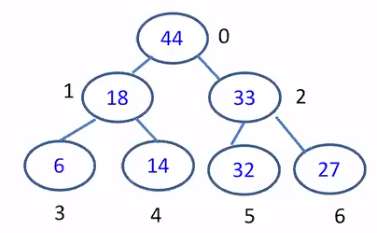

[\<- 05/13](05-13.md)

---

# Priority Queue

In a priority queue, an element with **high priority** is served before an element with low priority. If two elements have the same priority, they are served **according to their order** in the queue

### Example

- A priority queue example: Emergency room
	- FIFO
	- in case of emergency, a patient can be given priority

## Priority Queue & Queue

- In a queue, all the keys are ordered only according to when they enter the queue. Such order is not related to their priorities (e.g. values)

- In a priority queue, both the **key priorities** (e.g. values) and **their order** of entering the queue are considered. In addition, priority plays a more important role

## Implementation

- Assume you are required to organize a sequence as 5,20,18,10,3,18,20 in a priority queue. What is the dequeue sequence? (i.e. lower value indicating higher priority)
	- 3, 5, 10, 18, 18, 20, 20

- How to implement a priority queue?
	- Can we use sorted array? What are the worst-case big-O for enqueue and dequeue?
		- Enqueue will involve shifting -> O(n)
		- Dequeue can function as a circular queue -> O(1)
	- Can we use sorted linked list? What are the worst-case big-O for enqueue and dequeue?
		- Enqueue involves traversal -> O(n)
		- Dequeue is O(1)
		- No benefits with linked list
	- Can we do better? YES
		- **Binary Heap**

# Heap

- A heap is a **binary tree** with two properties:
	1. It's a complete (or nearly complete) tree in that it is built left-to-right and top-down (the shape)
	2. It's heap ordered: the root of every subtree is the **maximum value** in that subtree (the order)

- Technically these are called "max heaps" and we can also have "min heaps"

## Insertion

- The largest value in a binary max-heap is always the **root**
- Q: How do we insert a value into a max heap?
- A: We
	- insert the new node so as to **not break the shape of the tree**
	- We might **break the heap order**, so we then fix it

- To not break the shape, we insert the new node as the **next leaf from left to right** on the lowest level
- This may break the heap order, so we **fix the heap** nodes by repeatedly swapping the new value with its new parent - We call this process as reheap up
- ex. insert 30, 70, 50, 10, 20, 80, 40
- What is the big O?
	- O(h)

- Insertion is O(h), but h is always log(n), so insert is O(log(n))

## Deletion

- Q: How do we delete a value from a heap?
- A: We must first find it, so **we generally always delete the maximum value** because it's at the root
	- We first replace the root with the last value on the lowest level, so as to preserve the shape
	- This process may break the heap order, so we fix it by repeatedly swapping the upstart value with its larger child. Why not smaller child?
	- "reheap down"

- What is big O?
	- O(h) = O(log(n))

- Deletion (of the root) is also O(log(n))

## Implementation

- We will implement our heap using an **array**
- Let's look at implementing a heap

|Value    |44|18|33|6|14|32|27|-|-|
|---------|--|--|--|-|--|--|--|-|-|
|**Index**|0|1|2|3|4|5|6|7|8|

- Specifically, if the parent's node's index is i
	- left child is of i is `2*i + 1`
	- right child of i is `2*i + 2`
	- parent of i is `(i-1)/2`

- Example: Node 14 -> index = 4
	- parent should be index `(4-1)/2)` = 1

binary heaps work because of **no holes**, and are a great example of an implicit data structure that uses no extra space to let you know where everything is

## When to use Heap?

- Generally speaking, a heap can be used whenever you need **quick access** to the largest (or smallest) item, because that item will always be the first element in the array or at the root of the tree
- It's not good for searching, since the remainder of the array is kept partially unsorted
- Some examples of heap: priority queue, Huffman coding, heap sort, etc.

---

[05/18 ->](05-18.md)
