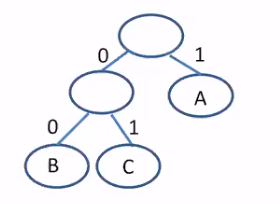
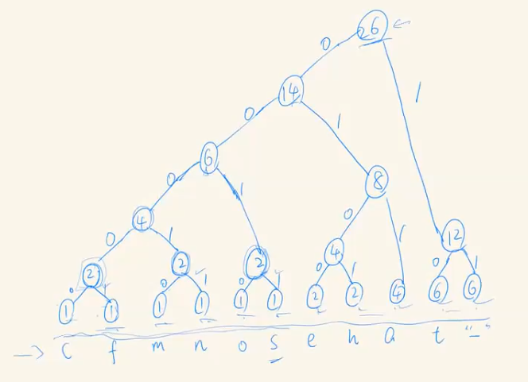

[\<- 05/15](05-15.md)

---

# An Application of Binary Trees: Huffman Coding

## Encoding

- Examples
	- Text
	- Video
	- Image
	- Audio

- Computer only understands low layer bits (0s and 1s)

- Encoding is turning those examples into the low layer bits

### An Application - Encoding

- An example - using only 1 and 0s to represent following cases
	- true or false - only need 1 bit
		- 1 is true
		- 0 is false
	- 4 directions: south, north, east, and west - need 2 bits
		- 00 is south
		- 01 is north
		- 10 is east
		- 11 is west

- ASCII is a fixed width encoding. Every character requires 8 bits to encode

- Motiviation: Can we save some bits in encoding?
- Thoughts:
	- some characters (like e and n) occur frequently. whereas characters (like q and z) occur very infrequently
	- Do you still remember probability search (move to front heuristic)?

### One Example

- Ex. "the fat cat sat on the mat"
	- If we use fixed-length binary code to represent the above sentence, what will that be? 26\*8
	- Can we save some bits by using fewer bits for more frequent letters?
		- Frequency of letters:
			- a:4, c:1, e:2, f:1, h:2, m:1, n:1, o:1, s:1, t:6, " ":6
		- Bits of letters
			- t & " ", frequently occur - 1 bit
			- a, h, e, less frequently - 2bits
			- etc.

## Huffman Coding

- Huffman Coding: **variable width encoding**
	- We are likely to **save on the total number of bits** required to encode a file/document if we represented frequently occurring character with fewer bits and infrequently occurring characters with more than 8 bits

- Question: How do we know, given a variable length encoding, where characters stop and start?
	- ex: if e=11, z=1111... so what's 111111?

- Answer: We use **unique prefixes**. Each character will have its own unique prefix -> how to implement?
	- We build a binary tree. By having only leaf nodes to represent characters, we are able to guarantee unique prefixes

## Huffman Tree

- Use binary trees (i.e. Huffman tree). e.g. 'ABCA'



- B: 00
- C: 01
- A: 1

- Question: How do we determine the optimal encoding given the frequencies of the characters?
- Answer: Use the leaf nodes that are farther away from the root to represent characters appear less frequently

- so now you have the "Huffman tree"
- label the left and right sub-branches of every node as 0 and 1 respectively

## Huffman Coding

- Ex. "the fat cat sat on the mat"
	- a:4, c:1, e:2, f:1, h:2, m:1, n:1, o:1, s:1, t:6, " ":6
	- create a node for each letter and sort according to their values
	- remove two minimum nodes, combine with a new node, and insert this node with a new weight - the combined value of its two child nodes
	- Is it better than the fixed length encoding?



- This is our Huffman Tree
- Our letters translate to:
	- a   -> 011
	- c   -> 00000
	- e   -> 0100
	- f   -> 00001
	- h   -> 0101
	- m   -> 00010
	- n   -> 00011
	- o   -> 0010
	- s   -> 0011
	- t   -> 10
	- " " -> 11

- This encoding only requires 80 bits (which significantly saves the number of bits needed for encoding)

---

### Code Structure

- A struct node includes:
	- `struct node *parent`
	- `int count`

1. Open file
	- count frequency of each character
	- need a while loop, need to use `getc()`
	- put characters in an array, assigning them an index reflecting their ascii code
	- the last slot on the array will be the EOF
	- the length of the array will be 257 (2^8 + 1)

2. `NODE *mknode(int data, NODE *left, NODE *right);`
	- We can use this function to generate the leaf nodes as well
	- also need node comparison

```
NODE *mknode(int data, NODE *left, NODE *right){
	NODE *np = malloc(...);
	assert(...);
	np->parent = NULL;
	np->count = data;
	//connect
}
```

3. `pq = createqueue()`
	- call addEntry: `addEntry(pq, nodes[i]);`
	- `l = removeEntry(pq);`
	- `r = removeEntry(pq);`
	- `new = mknode(l->count + r->conut, l, r)`
	- `addEntry(pq, np);`

4. print 

---

[05/22 ->](05-22.md)
