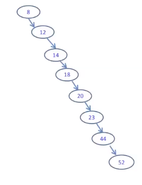
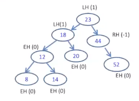
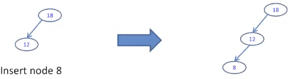
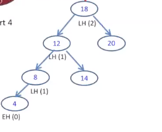
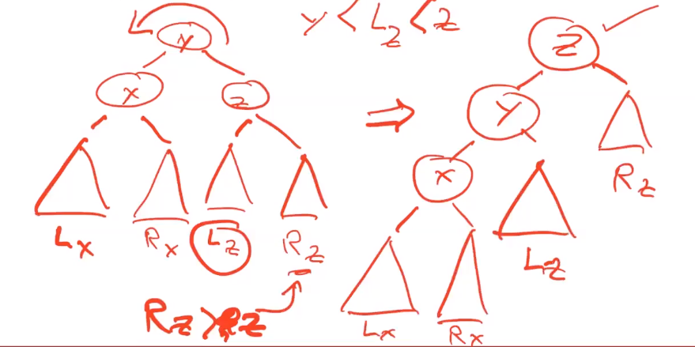

[\<- 05/18](05-18.md)

---

## A Question

- How many tests do we need to do in order to locate node 52?
- This tree was made with an array of values in sorted order and has a big-O of O(n) (bad!)
- How can we make it easier to traverse?

## AVL Tree Definition

- An AVL tree is a binary search tree in which **the heights of the subtrees of any given node differ by no more than 1**
- It is a **balanced binary search tree**
- An AVL tree is a binary tree that either is empty or consists of two AVL subtrees, Tl and Tr, whose heights differ by no more than 1
	- `|Hl - Hr| <= 1`

- What are the possible values for balance factor of an AVL tree?
	- 0, -1, 1

## An Example

1. Check the value - BST
2. Check the shape - Balanced binary tree
	- For each node, we use
		- LH to indicate that the left subtree is higher than the right subtree
		- RH to indicate that the left subtree is shorter than the right subtree
		- EH to indicate that the subtrees are the same height

- Is this an AVL tree?

## AVL Tree - Operations

- The **search** and **traversal** of AVL tree is the same as BST
	- What is the worst-case big-O run time for AVL tree search? O(log(n))
		- Remember worst-case big-O of BST was O(n)
- How about **insertion** & **deletion**
	- They are different
	- Why?
		- AVL tree is a balanced tree, while insertion/deletion may **make it unbalanced**

## AVL Tree - Insertion/Deletion

- We can consider insertion as two steps
	- Insert the node at a leaf/leaflike node - (**the same as BST insertion**)
	- **Back out** of the tree and balance each node
- We consider deletion as two steps
	- Delete the node - (**the same as BST deletion**)
	- **Back out** of the tree and balance each node

- Example:

- After inserting 8, 12 is LH, but 18 is too uneven

# How to do Balance?

## Four Cases for Rebalancing

1. Left of Left -> Rotate right
2. Right of Right -> Rotate left
3. Right of Left -> Rotate parent right, child left
4. Left of Right -> Rotate parent left, child right

- First two cases require one rotation, last two cases require two rotations

## Meaning of Rotations

- Rotate to the left
	- Your **original right child** becomes your parent
	- After rotation, you are the left child of your parent
	- If your new parent originally had a **left child**, you need to take it as your child

- Rotate to the right
	- Your **original left child** becomes your parent
	- After rotations, you are **the right child** of your parent
	- If your new parent originally had a **right child**, you need to take it as your child

## Summaries

- Starting from the newly inserted/deleted node, go back to the root of the entire tree. Along the path, calculate balance factor for each node and rebalance the unbalanced nodes **one by one** through rotations. (**The order matters!**)

- For each unbalanced node:
	1. Identify it as one of the four cases (i.e. left-of-left, right-of-right, left-of-right, right-of-left) by checking itself and its higher subtree. For example, if an unbalanced node is LH, the case if left-of-left
	2. Rotate nodes accordingly
	3. Back out to handle another unbalanced node if there's any

## Exercise I - Complex Rotation

- Left of Left
- We only need to look at the left side
- We need to rotate to the right to reblanace

## AVL Tree Insertion practice

- Let's take some arbitrary numbers and let's insert them into an AVL tree

- Don't be concerned about the costs of rotation: the only thing that's changing is pointers

- Another example (recommended to draw the tree as we describe it):
	- Let's insert 8, 6, 7, 5, 2
	- Insert 8 as root
	- Insert 6 as left child of 8
	- insert 7 as right child of 6
		- Now the tree is unbalanced (right-of-left)
		- First, rotate 6 to get 8 -> 7 -> 6
		- Now the tree is left-of-left, so we just rotate the root right
		- Now 7 is the root, 6 is the left child, 8 is the right child
	- insert 5 as the left child of 6
	- insert 3 as the left child of 5
		- Now the tree is unbalanced (left-of-left)
		- Rotate the root (7) to the right
		- Now 6 is the root, 5 is the left child, 3 is 5s left child, 7 is the right child, 8 is 7s right child

## AVL Deletion

- Delete the specified node, then rebalance the tree if necessary
- Remember that deleting a parent involves a bit of cleaning (like with a BST)

[website to visualize AVL Trees](https://www.cs.usfca.edu/~galles/visualization/AVLtree.html)

---

|SET            |Unsorted Array|Sorted Array|Hash Table|Unsorted Linked List|Sorted Linked List                 |BST                    |AVL Tree|
|---------------|--------------|------------|----------|--------------------|-----------------------------------|-----------------------|--------|
|**Search/Find**|O(n)          |O(log(n))   |O(n)      |O(n)                |O(n)                               |O(h) (log(n) <= h <= n)|O(log(n))|
|**Add**        |O(n)          |O(n)        |O(n)      |O(n)                |O(n)                               |O(h) (log(n) <= h <= n)|O(log(n))|
|**Remove**     |O(n)          |O(n)        |O(n)      |O(n)                |O(n)                               |O(h) (log(n) <= h <= n)|O(log(n))|
|**Min/Max**    |O(n)          |O(1)        |O(m)      |O(n)                |O(1) (assuming fast access to tail)|O(h) (log(n) <= h <= n)|O(log(n))|

---

[05/27 ->](05-27.md)
