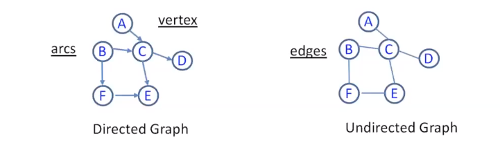
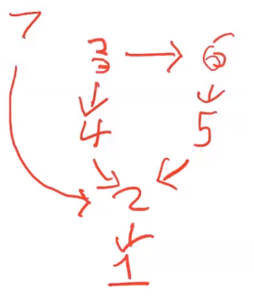
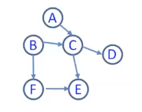
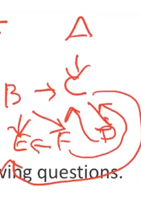
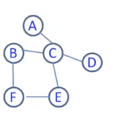

[\<- 05/27](05-27.md)

---

## A Brief Review

- Linear list: each element can have only one successor
	- Queue, stack
- Non-linear list: each element can have more than one successors
	- Tree: Each element (i.e., node) can have only one predecessor
		- General tree
		- Binary tree
			- Binary Search tree
				- AVL tree
			- Binary Heap
	- Graph: Each element can have more than one predecessor

## Trees & Graphs

- A tree is a collection of nodes in which each node has at most **one predecessor** (the parent) but **arbitrarily many successors** (the children)
- A graph is a collection of nodes in which each node can have an **arbitrary number of both predecessors and successors**

## Graphs - Categories

- Directed & Undirected
	- vertex is the same as node



- Weighted Graph
	- There will be a metric on each edge

## Graphs - Cycle / Acyclic

- A **cycle** is a **non-empty** sequence of **distinct** edges from a vertex back to itself
- A graph without cycles is called **acyclic**
- Examples
	- A directed graph is acyclic
	- An undirected graph might have a cycle

- Can you have a cycle in a two-node undirected graph? how about a line?
	- No, "distinct edges" remember?

## Graphs

- A directed acyclic graph is called a **dag**
- Dags are often used to model dependencies
- For example, we have 6 courses as A, B, C, D, E, F. As shown below,
	- Course A requires course C as prerequisite
	- Course B requires course C and F as prerequisite
	- Course C requires course D and E as prerequisite,
	- ...

### Example

- Example dependencies:
	- Get up in the morning -- 1
	- Take a Shower -- 2
	- Put on Shoes -- 3
	- Put on Socks -- 4
	- Put on Underwear -- 5
	- Put on Pants -- 6
	- Put on Shirt -- 7

- Draw the Graph:



- A graph is called **planar** if it can be drawn in a single plane with no edges crossing
	- loved by EE majors for obvious reason

- A graph in which each vertex is connected to every other vertex is called a **clique**. Are the following cliques planar?
	- three-clique? **yes**
	- four-clique? **yes**
	- five-clique? **no**

- When discussing graphs we use two variables
	- V = # of vertices
	- E = # of edges
- Is there any relationship between V and E?

- Assume that our graph is directed. What is the max # of edges given V?
	- V^2 (or V(V-1) if you ignore self loops)
- Assuming it's undirected (and no self-loops)?
	- (V(V-1))/2
- So big-O of E is O(V^2)

- A graph is called **sparse** if E is much less than V^2, and is called **dense** if E is close to V^2
- Question: for any airline map between 30 airports in reality, is it dense?
	- Does, for example, Southwest fly 900 routes?

---

# Graph Representations

## Adjacency Matrix

- **adjacency matrix**:
	- `a[i][j] <> 0 iff i -> j`

- Example:



|     |A|B|C|D|E|F|
|-----|-|-|-|-|-|-|
|**A**|0|0|1|0|0|0|
|**B**|0|0|1|0|0|1|
|**C**|0|0|0|1|1|0|
|**D**|0|0|0|0|0|0|
|**E**|0|0|0|0|0|0|
|**F**|0|0|0|0|1|0|

- The meaning of "sparse" should be starkly clear in the matrix

- How about undirected graph?
	- Always symmetric

- How about space complexity?
	- O(V^2)

## Adjacency List

- **Adjacency List**
	- Using the graph above:
	- A: {C}
	- B: {C, F}
	- C: {D, E}
	- D: {}
	- E: {}
	- F: {E}

- How about undirected graph?
	- A: {C}
	- B: {C, F}
	- C: {A, B, D, E}
	- etc.

- What is the space complexity?
	- Notice that the number of entries reflects E
	- O(E) space complexity for adjacency list

## Exercise

|     |A|B|C|D|E|F|
|-----|-|-|-|-|-|-|
|**A**|0|0|1|0|0|0|
|**B**|0|0|1|0|1|1|
|**C**|0|0|0|1|1|0|
|**D**|0|0|1|0|0|0|
|**E**|0|0|0|0|0|0|
|**F**|0|0|1|0|1|0|

- Given the adjacency matrix, answer the following questions
	1. What is the adjacency list?
		- A: {C}
		- B: {C, E, F}
		- C: {D, E}
		- D: {C}
		- E: {}
		- F: {C, E}

	2. Is the graph directed or undirected?
		- directed

	3. Draw the graph:



Time Complexity:
	- Given a Vertex A, what are the adjacent nodes?
		- Adjacency Matrix: Always O(V)
		- Adjacency list: Worst-case O(V), depends on the graph sparseness
	- Find if edge A-\>B exist in the graph?
		- Adjacency matrix: O(1)
		- Adjacency list: Worst-case O(V)

## Comparison

- Space complexity:
	- Adjacency matrix: O(V^2)
	- Adjacency list: O(E)
	- Which one could save more space for a sparse graph?
- Time Complexity:
	- Determining the presence of an edge
		- **Adjacency matrix** is faster (O(1))
	- Determining the list of all adjacent nodes
		- **Adjacency list** is faster on average, worst-case O(V)

- Recommendations:
	- If sparse: list
	- If dense: matrix
	- Note that most graphs will be sparse

## Requirements/Expectation

- Given a graph, be able to provide its adjacency matrix & adjacency list
- Given an adjacency matrix (or adjacency list), be able to draw the graph
- Understand the differences in adjacency matrices/lists for directed graph & undirected graph
- Compare adjacency matrix & adjacency list (space and time)

---

## Graphs - When to use it?

- Examples:
	- Maps
	- Online Social Networks
	- Neural Networks

# Graph Traversals

## Graph Algorithms - Traversal

- We want to visit all nodes in a graph
- Challenge: unlike trees
	- graphs can have cycles,
	- and more than one way to visit the same node...
- Both issues demand that we **avoid visiting the same node**
	- We need to avoid cycles and avoid repeats
	- We will solve these problems by marking each vertex

- Review of preorder traversal:

```
void visit(n){
	if(n is not empty){
		print n;
		for each child ch of n do visit(ch);
	}
}
```

- This code will not work on a graph
	- Could visit a node multiple times
	- Could loop forever

- Modification of preorder traversal

```
void visit(n){
	label n as marked
	print n
	for each adjacent node adj of n do{
		if(adj is no marked) visit(adj)
	}
}
```

- This code will work on a graph:
	- A node will only be marked once
	- So we cannot visit a node more than once and accidently print it twice or get stuck in a cycle

- We just covered **depth-first search**/traversal. **DFS**
- So called because you down as far as you can before you backtrack and try another option
- The robot in the maze game used this algorithm: it explored as far as it could before backtracking



- Using the example graph above, show the DFS order starting from A
	- A, C, D, B, F, E
- Not do a DFS from B
	- B, E, F, C, A, D
- Now do a DFS from F
	- F, B, C, A, D, E

- DFS was recursive and therefore used a **stack**
- You can either make your function recursive and let the system take care of it
- Or you can make your own stack (that's what we did for the maze game)
- Another logical choice is to use a **queue**
- In this case, we'll have to make our own queue and maintain it as we go along

- Modification of traversal:

```
void visit(n){
	label n as marked and add it to the queue
	
	while(the queue is not empty) do{
		let n be the result of dequeue
		for each adjacent node adj of n do{
			if(adj is not marked) label adj as marked and add it to the queue
		}
	}
}
```

- This code will work on a graph:
	- It will only add a node to the queue if it hasn't already been marked

- We just covered **breadth-first search**/traversal, **BFS**
- It is so called because instead of going down, you go across
- Proceed all the neighbors at distance 1, then all from distance 2, etc.


- Example: BFS starting from A
	- A, C, B, D, F, E
	- Notice as you print nodes, the nodes are farther and farther away from A
		- A is distance 0
		- C is distance 1
		- B, D, E are distance 2
		- F is distance 3
- Example: BFS starting from E
	- E, C, F, A, B, D
- Example: is the traversal (starting from A) BFS or DFS?
	- A, C, D, B, F, E
	- it is DFS
	- can it also be BFS? NO (it would not output F before E)

- Relation to Trees
	- DFS reflects preorder
	- BFS reflects level by level

## Requirements/Expectations

- Given a graph, be able perform a depth-first and breadth-first search
- Understand when you would choose one over other
- What is the complexity of each algorithm
	- We only print out each node once
	- However, we may have to check a node multiple times
	- How many times? That depends on how many edges lead to it
	- Although we print out each node only once, we must examine every edge in the graph
	- So, the complexity of DFS and BFS is O(V+E). (The V comes from the face that we have to initially unmark all vertices before we start a search)

---

[06/01 ->](06-01.md)
