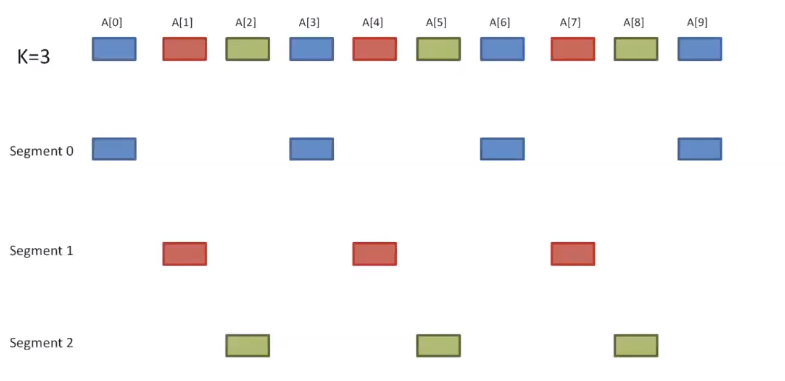

[\<- 06/01](06-01.md)

---

## Heap Sort

- An improved version of Selection sort
- How it works?
	- Build a max-heap (O(nlog(n)))
	- Select the largest element based on the heap and swap it with the last element in the unsorted list, and reheap (O(nlog(n)))
	- Partitioned array: left side is an unsorted heap, right side is sorted
	- total O(nlog(n)) (much faster than O(n^2))
	- theoretically the fastest algorithm

- Example: 32, 78, 45, 8, 56, 23

|Heap          |to be inserted|to be inserted|to be inserted|to be inserted|to be inserted|
|--------------|--------------|--------------|--------------|--------------|--------------|
|32            |78            |45            |8             |56            |23            |

- Insert 78

|Heap          |Heap          |to be inserted|to be inserted|to be inserted|to be inserted|
|--------------|--------------|--------------|--------------|--------------|--------------|
|32            |78            |45            |8             |56            |23            |

- To maintain the heap, swap 32 and 78

|Heap          |Heap          |to be inserted|to be inserted|to be inserted|to be inserted|
|--------------|--------------|--------------|--------------|--------------|--------------|
|78            |32            |45            |8             |56            |23            |

- Insert 45

|Heap          |Heap          |Heap          |to be inserted|to be inserted|to be inserted|
|--------------|--------------|--------------|--------------|--------------|--------------|
|78            |32            |45            |8             |56            |23            |

- Insert 8

|Heap          |Heap          |Heap          |Heap          |to be inserted|to be inserted|
|--------------|--------------|--------------|--------------|--------------|--------------|
|78            |32            |45            |8             |56            |23            |

- Insert 56

|Heap          |Heap          |Heap          |Heap          |Heap          |to be inserted|
|--------------|--------------|--------------|--------------|--------------|--------------|
|78            |32            |45            |8             |56            |23            |

- Swap 32 and 56

|Heap          |Heap          |Heap          |Heap          |Heap          |to be inserted|
|--------------|--------------|--------------|--------------|--------------|--------------|
|78            |56            |45            |8             |32            |23            |

- Insert 23

|Heap          |Heap          |Heap          |Heap          |Heap          |Heap          |
|--------------|--------------|--------------|--------------|--------------|--------------|
|78            |56            |45            |8             |32            |23            |

- Now the heap has been created, but we still need to sort it
- Swap 23 and 56

|Heap          |Heap          |Heap          |Heap          |Heap          |Sorted        |
|--------------|--------------|--------------|--------------|--------------|--------------|
|23            |56            |45            |8             |32            |78            |

- Reheap down to get

|Heap          |Heap          |Heap          |Heap          |Heap          |Sorted        |
|--------------|--------------|--------------|--------------|--------------|--------------|
|56            |32            |45            |8             |23            |78            |

- Swap 56 and 23

|Heap          |Heap          |Heap          |Heap          |Sorted        |Sorted        |
|--------------|--------------|--------------|--------------|--------------|--------------|
|23            |32            |45            |8             |56            |78            |

- Reheap Down

|Heap          |Heap          |Heap          |Heap          |Sorted        |Sorted        |
|--------------|--------------|--------------|--------------|--------------|--------------|
|45            |32            |23            |8             |56            |78            |

- Swap 45 and 8

|Heap          |Heap          |Heap          |Sorted        |Sorted        |Sorted        |
|--------------|--------------|--------------|--------------|--------------|--------------|
|8             |32            |23            |45            |56            |78            |

- Reheap Down

|Heap          |Heap          |Heap          |Sorted        |Sorted        |Sorted        |
|--------------|--------------|--------------|--------------|--------------|--------------|
|32            |8             |23            |45            |56            |78            |

- Swap 32 and 23

|Heap          |Heap          |Sorted        |Sorted        |Sorted        |Sorted        |
|--------------|--------------|--------------|--------------|--------------|--------------|
|23            |8             |32            |45            |56            |78            |

- Reheap Down (same)
- Swap 23 and 8

|Heap          |Sorted        |Sorted        |Sorted        |Sorted        |Sorted        |
|--------------|--------------|--------------|--------------|--------------|--------------|
|8             |23            |32            |45            |56            |78            |

- Done!

- Is it stable?
	- No (too much swapping to easily predict where things will be)
		- This is the only downside of Heap Sort
	- 78, 56, 32, **32**, 8, 23, 45

- Big O
	- Worst case: O(nlog(n))
	- Best case: O(nlog(n))
	- Average case: O(nlog(n))

- Space overhead? O(1)

## Shell Sort

- An improved version of the insertion sort in which **diminishing partitions** are used to sort the data

- How does it work?
	- A list of N elements is divided into **K segments**, where K is known as the increment
	- For each segment, do insertion sort
	- Reduce the value of K and repeat the process, until K=1

### Demonstration



- We do insertion sort on each segment

### Example

- 77, 62, 14, 9, 30, 21, 80, 25, 70, 55
- We set k= 5, 3, 1 progressively

|77|62|14|9 |30|21|80|25|70|55|
|--|--|--|--|--|--|--|--|--|--|

- Initial Sub-Arrays
	- 77, 21
	- 62, 80
	- 14, 25
	- 9, 70
	- 30, 55
- After sorting the segments, we get
	- 21, 77
	- 62, 80
	- 14, 25
	- 9, 70
	- 30, 55

|21|62|14|9 |30|77|80|25|70|55|
|--|--|--|--|--|--|--|--|--|--|

- Now, k=3, the new sub-arrays are
	- 21, 9, 80, 55
	- 62, 30, 25
	- 14, 77, 70
- After sorting the segments, we get
	- 9, 21, 55, 80
	- 25, 30, 62
	- 14, 70, 77

|9 |25|14|21|30|70|55|62|77|80|
|--|--|--|--|--|--|--|--|--|--|

- Now k=1, so the new sub-arrays will be length 1, and we will effectively just be doing an insertion sort
	- This will actually be pretty fast, since by this point the array is nearly sorted

### Code

```
void shellSort(int a[], int n){
	int i, j, temp, k;

	foreach value of k do{
		for(i=k; i<n; i+=k){
			temp = a[i];
			for(j = i-k; j>=0 && temp<a[j]; j-=k){
				a[j+k] = a[j];
			}
			a[j+k] = temp;
		}
	}
}
```

- Notice that the code inside the for loop is just insertion sort

- How to choose K?
	- Prime numbers
	- A power of 2 minus 1 (i.e. k = 2^i - 1)
	- Fibonacci series

- Is it stable?
	- No
	- 5 4 **4** 2 3 6

- Big O
	- Worst case - depends, O(n^(3/2)) if right k sequence chosen
	- Average case - depends, O(n^(4/3)) (as above)
	- Best case - O(nlog(n))

- Space Overhead O(1)

### Additional Notes

- Best-case Big-O analysis:
	- comparisons =
		- n, for 1 sort with elements 1-apart (last step)
		- \+ 3 * n/3, for 3 sorts with elements 3-apart (next-to-last step)
		- \+ 7 * n/7, for 7 sorts with elements 7-apart
		- \+ 15 * n/15, for 15 sorts with elements 15-apart

- Each term is n. The question is how many terms are there? The number of terms is the value k such that (2^i - 1)\<n; So i\<log(n+1), meaning that the sorting time in the best case is less than n * log(n+1) = O(n\*log(n))

### Summary

- The method starts by sorting pairs of elements **far apart from each other**, then **progressively reducing the gap** between elements to be compared. Starting with far apart elements can move some out-of-place elements into position faster than a simple nearest neighbor exchange

## Tree Sort

- Two steps:
	- Insert each value from the array into a binary search tree
	- Traverse the binary search tree in order and transfer the data back into the array

- Worst case: O(n^2) if BST, O(nlog(n)) if AVL
- Average case: O(nlog(n))
- Best case: O(nlog(n))

- Space overhead? O(n) (high!)
	- You need to build a binary tree for this sort

- It is stable!

---

[06/06 ->](06-05.md)
