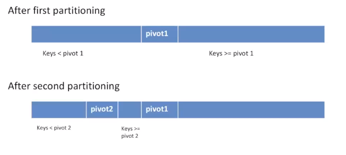
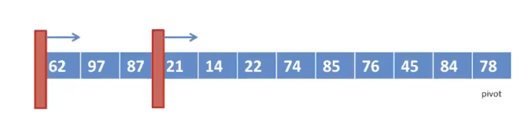
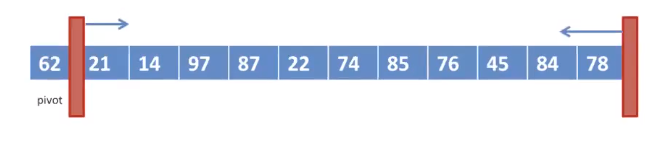

[\<- 06/03](06-03.md)

---

# Quick Sort and Merge Sort

- Last two sorting algorithms: quick sort and merge sort
- Both are examples of a divide and conquer algorithm (more properly called divide, conquer, and unite)
	1. Divide: Split a problem into subproblems
	2. Conquer: Recursively solve each subproblem
	3. Unite: Combine the answers from the subproblems

- Typically, either the divide or unite step is trivial
	- If you're doing a lot of work to divide the problem and also a lot of work to combine the results, you've chosen a wrong approach!

## Comparison

- Quick sort is an efficient exchange-based sort
	- The unite step is trivial: it's actually missing!
	- The hard work is done in the divide step

- Merge sort falls into the "other" category
	- The divide step is trivial: it's just one line of code
	- The hard work is done in the unite step

- Both are **recursive** sorting algorithms

## Recursive Array Algorithms

- A typical array algorithm is passed the array and its size
	- `void insertionSort(int a[], int n);`

- Recursive algorithms on arrays operate on **subarrays**
- They have to be passed the lower bound and upper bound of the subarray
	- `void bsearch(int a[], int lo, int hi, int x);`

- The lower and upper bounds are **inclusive**
	- `bsearch(a, 0, n-1, x);`

## Review: Binary Search

```
bool bsearch(int a[], int lo, int hi, int x){
	int mid;

	if(lo > hi) return false;

	mid = (lo + hi)/2;

	if(x == a[mid]) return true;
	else if(x < a[mid]) return bsearch(a, lo, mid-1, x);
	else return bsearch(a, mid+1, hi, x);
}
```

# Quick Sort

- How it works
	- Each time, selects an element, known as **pivot**
	- Reorder the array so that all elements with values **less** than the pivot **come before** the pivot, while all elements with values **greater** than the pivot **come after it** (equal values can go either way). After this partitioning, **the pivot is in its final position**. This is called the partition operation
	- **Recursively** apply the above steps to the sub-array of elements with smaller values and separately to the sub-array of elements with greater values

## Code

```
void quicksort(int a[], int lo, int hi){
	if(hi > lo){
		int p = partition(a, lo, hi); //divide
		quicksort(a, lo, p-1); //conquer left half
		quicksort(a, p+1, hi); //conquer right half
	}
}
```

## Demonstration



## Selection of Pivot

- It's important - affect Big O
- How
	- Select the leftmost one or rightmost one
	- find the median:

|78|21|14|97|87|62|74|85|76|45|84|22|
|--|--|--|--|--|--|--|--|--|--|--|--|

- The leftmost and rightmost elements are pretty skewed...
	- Solution: do 3 comparisons
- Compare the leftmost value and the middle value. If they are out of order, swap them

|62|21|14|97|87|78|74|85|76|45|84|22|
|--|--|--|--|--|--|--|--|--|--|--|--|

- Compare leftmost and rightmost value. If they are out of order, swap them

|22|21|14|97|87|78|74|85|76|45|84|62|
|--|--|--|--|--|--|--|--|--|--|--|--|

- Compare middle value and rightmost value. If they are out of order, swap them

|22|21|14|97|87|62|74|85|76|45|84|78|
|--|--|--|--|--|--|--|--|--|--|--|--|

- Now we have a smaller value in the leftmost, a middling value in the middle, and a larger value in the rightmost

## Lomuto's Partition Algorithm



- Two magic walls
- Move second wall **from left to right**: Looking for the elements less than the pivot
- When found, swap with value at first wall, and advance first wall
- When all done, place the pivot in the middle

### Code

```
int partition(int a[], int lo, int hi){
	p = a[hi]; //last value is pivot
	sep = lo;

	for(i = lo, i<hi, i++){
		if(a[i] < p){
			swap(a[i], a[sep]);
			sep++;
		}
	}

	swap(a[hi], a[sep]);
	return sep;
}
```

### Example

|\||78|21|14|97|87|22|74|85|76|45|84|\||62|
|--|--|--|--|--|--|--|--|--|--|--|--|--|--|
|wall|  |  |  |  |  |  |  |  |  |  |  |wall|pivot|

- Check 78: greater than 62, so it should be after the wall
- Check 21: less than 62, so it should be before the wall

|21|\||78|14|97|87|22|74|85|76|45|84|\||62|
|--|--|--|--|--|--|--|--|--|--|--|--|--|--|
|  |wall|  |  |  |  |  |  |  |  |  |  |wall|pivot|

- Check 14: less than 62, so it should be before the wall

|21|14|\||78|97|87|22|74|85|76|45|84|\||62|
|--|--|--|--|--|--|--|--|--|--|--|--|--|--|
|  |  |wall|  |  |  |  |  |  |  |  |  |wall|pivot|

- Check 97: greater than 62, so it should be after the wall
- Check 87: greater than 62, so it should be after the wall
- Check 22: less than 62, so it should be before the wall

|21|14|22|\||97|87|78|74|85|76|45|84|\||62|
|--|--|--|--|--|--|--|--|--|--|--|--|--|--|
|  |  |  |wall|  |  |  |  |  |  |  |  |wall|pivot|

- Check 74: greater than 62, so it should be after the wall
- Check 85: greater than 62, so it should be after the wall
- Check 76: greater than 62, so it should be after the wall
- Check 45: less than 62, so it should be before the wall

|21|14|22|45|\||87|78|74|85|76|97|84|\||62|
|--|--|--|--|--|--|--|--|--|--|--|--|--|--|
|  |  |  |  |wall|  |  |  |  |  |  |  |wall|pivot|

- Check 84: greater than 62, so it should be after the wall
- Now, all that's left to do is swap the pivot with 87

|21|14|22|45|\||62|\||78|74|85|76|97|84|87|
|--|--|--|--|--|--|--|--|--|--|--|--|--|--|
|  |  |  |  |wall|pivot|wall|  |  |  |  |  |  |

## Hoare's Partition Algorithm



- Move **from left to right**: Looking for the element to place on the **right** of the pivot
- Move **from right to left**: Looking for the element to place on the **left** of the pivot
- Exchange them and move forward
- When the two walls meet, place the pivot in the middle
- Does approx. 1/3 swaps as previous partition algorithm

### Example

|\|   |06   |02   |04   |01   |05   |07   |08   |\|   |03   |
|-----|-----|-----|-----|-----|-----|-----|-----|-----|-----|
|wall |     |     |     |     |     |     |     |wall |pivot|

- Is 6 bigger than 3? yes
- Is 2 bigger than 3? no
	- swap 2 and 6
	- move the wall

|02   |\|   |06   |04   |01   |05   |07   |08   |\|   |03   |
|-----|-----|-----|-----|-----|-----|-----|-----|-----|-----|
|     |wall |     |     |     |     |     |     |wall |pivot|

- Is 4 bigger than 3? yes
- Is 1 bigger than 3? no
	- Swap 1 and 6
	- move the wall


|02   |01   |\|   |04   |06   |05   |07   |08   |\|   |03   |
|-----|-----|-----|-----|-----|-----|-----|-----|-----|-----|
|     |     |wall |     |     |     |     |     |wall |pivot|

- Is 5 bigger than 3? yes
- Is 7 bigger than 3? yes
- Is 8 bigger than 3? yes
- Now, we just need to put the pivot in the middle by swapping 3 and 4

|02   |01   |\|   |03   |\|   |06   |05   |07   |08   |04   |
|-----|-----|-----|-----|-----|-----|-----|-----|-----|-----|
|     |     |wall |pivot|wall |     |     |     |     |     |

- Then we would do it all again with the partitions...

---

- Comparison with bubble sort
	- In bubble sort, **consecutive items** are compared and possible exchanged on each pass through the list => more exchanges are required
	- In quick sort, a typical exchange involves elements that are **far apart** => fewer exchanges are required to correctly position an element

## Analysis: Best Case

- Assume we always find the median as the pivot
- An array of size n always splits into two arrays of size n/2
	- At level 1, we do n steps in partition
	- At level 2, we do 2 * (n/2) steps (2 partitions of size n/2)
	- At level 3, we do 4 * (n/4) steps (4 partitions of size n/4)
	- ...

- How many levels are there? O(log(n))
- Total amount of work is O(nlog(n))

## Analysis: Worst Case

- Assume we always find the largest value as the pivot
- An array of size n always splits into an array of size n-1, and another array of size 0
	- At level 1, we do n steps in partition
	- At level 2, we do n-1 steps (1 partition of size n-1)
	- At level 3, we do n-3 steps (1 partition of size n-2)
	- ...

- Total amount of work is n + (n-1) + (n-2) + ... + 1 = O(n^2)

- Big-O analysis
	- Best case? - O(nlog(n))
	- Average case? = O(nlog(n))
	- Worst case? - O(n^2)

- Stability?
	- Consider sequence 5 6 **6** 3 2
	- not stable

### Space Overhead

- Space overhead? O(1) O(log(n))? O(n)?
	- Each recursive call has O(1) space overhead

- What is the average depth of recursion? O(log(n))
- What is the worst case depth of recursion? O(n)
	- But if we are clever, we can reduce that
	- Recurse on the smaller sublist, then loop back and do the larger list

- So, the space overhead in the worst case is O(log(n))

# Merge Sort

- How it works
	- Split the array in half. Unlike quick sort we always split the array exactly in half
	- **Recursively** sort each half. An array of size 0 or 1 is already sorted
	- **Merge** each half linear time

## Merging

- Consider two sorted arrays, a and b
- Keep an index i and j into each array
- Compare a]i\ and b]j\
- Place the smaller in the output and advance the index
- If you reach the end of either array, copy the other array's contents into the output
- Runtime is O(length of a + length of b)

### Merging Example

- Merge 1, 3, 5, 6 with 2, 4, 5, 8
	- 1 2 3 4 5 5 6 8
	- Merging is O(n)

## Code

```
void mergesort(int a[], int lo, int hi){
	if(hi > lo){
		int mid = (lo + hi)/2;        //divide
		mergesort(a, lo, mid-1);      //conquer left half
		mergesort(a, mid, hi);        //conquer right half
		merge(a, lo, mid-1, mid, hi); //unite
	}
}
```

## Example

- 6 2 4 1 6 7 8 3
	- Cut it in half
	- 6 2 4 1
		- Cut it in half
		- 6 2
		- 4 1
	- 5 7 8 3
		- Cut it in half
		- 5 7
		- 8 3

- First half
	- sort 6 2 -> 2 6
	- sort 4 1 -> 1 4
	- merge them
		- 1 2 4 6

- Second half
	- sort 5 7 -> 5 7
	- sort 8 3 -> 3 8
	- merge them
		- 3 5 7 8

- Now all that's left is to merge the two halves
	- 1 comes before 3
	- 2 comes before 3
	- 3 comes before 4
	- 4 comes before 5
	- 5 comes before 6
	- 6 comes before 7
	- add 7 and 8 to the end
	- **1 2 3 4 5 6 7 8**

## Analysis

- Big O analysis
	- Best case? = O(nlog(n))
	- Average case? = O(nlog(n))
	- Worst case? = O(nlog(n))

- Stability?
	- Yes! As long as we break a tie by always choosing from the first list

- Space overhead? O(n)!
	- Cannot merge in place! Need to use separate array

# Summary

|                  |Best Case |Average Case |Worst Case   |Stability |Space Overhead|
|------------------|--------- |------------ |----------   |----------|--------------|
|**Selection Sort**|O(n^2)    |O(n^2)       |O(n^2)       |Not stable|O(1)          |
|**Heap Sort**     |O(nlog(n))|O(nlog(n))   |O(nlog(n))   |Not stable|O(1)          |
|**Insertion Sort**|O(n)      |O(n^2)       |O(n^2)       |Stable    |O(1)          |
|**Shell Sort**    |O(nlog(n))|>= O(n^(4/3))|>= O(n^(3/2))|Not stable|O(1)          |
|**Bubble Sort**   |O(n)      |O(n^2)       |O(n^2)       |Stable    |O(1)          |
|**Quick Sort**    |O(nlog(n))|O(nlog(n))   |O(n^2)       |Not stable|O(log(n))     |
|**Merge Sort**    |O(nlog(n))|O(nlog(n))   |O(nlog(n))   |Stable    |O(n)          |
|**Tree Sort**     |O(nlog(n))|O(nlog(n))   |O(nlog(n))   |Stable    |O(n)          |
